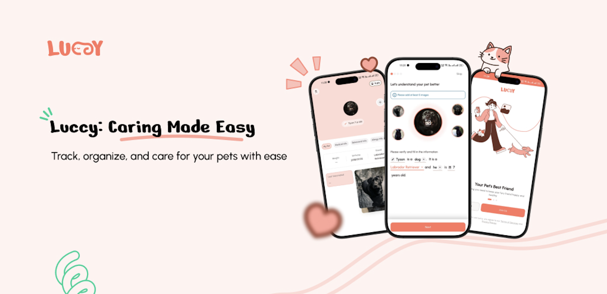

# 🐾 Luccy

### Built for pets. Powered by AI.

Luccy is where **pet care meets smart tech**.

We’re building an AI-powered platform that helps you **find lost pets, manage their lives, and stay connected** — all in one place. No chaos, no guesswork — just a smarter way to care for your pets.

---

### 🚀 What’s the vibe?

- 🧠 AI that recognizes and matches pets  
- 🔍 Lost & found, but actually effective  
- 🏥 Vet support without the hassle  
- 🐶 Pet profiles that *actually* matter  
- 🤝 A community that’s got your back  

---

### 🌍 The bigger picture

We’re not just building an app.  
We’re building a world where **no pet goes missing without a trace**  
and every owner has access to **real, reliable care**.

---

### 💡 Why Luccy?

Because your pet isn’t just a pet.  
And pet care shouldn’t feel outdated.

---

### ⚡ Status

🚧 Currently building.  
🚀 Launched and you can find in both Android and Ios.

---

### 👀 Stay with us

For More Updates
